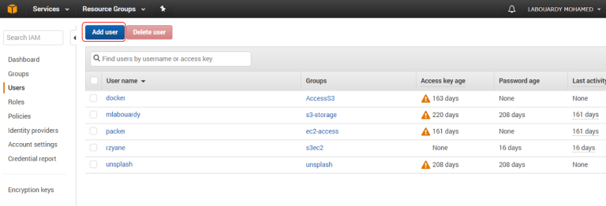
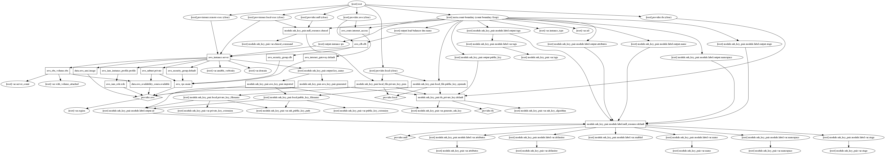

# Terraform-ansible

provision with ansible inside terraform to deploy a spring project


## Decisions
I choosed to create the 2 server with a count variable because it was making it more interesting to work with variables

I added the [terraform-aws-key-pair](https://github.com/cloudposse/terraform-aws-key-pair) module to automate the keypair process

### reason for choices

- ansible - because of the simplicity of it
- aws - because I was interested in testing it

I created a check waiting for the webpage to be available therefore previous instance will be destroyed only when new is online (avoid downtime)

---
## Structure

**ansible** - folder with ansible playbooks and configuration

**aws** - folder with terraform infrastructure files

**imgs** - documentation images

**secrets** - generated folder with keypair files

**spring** - java project source

---
## Install prerequisites

Simply install aws, terraform and ansible following official documentation for your operating system

[Install aws](https://docs.aws.amazon.com/cli/latest/userguide/installing.html)

[Install terraform](https://www.terraform.io/downloads.html)

[Install ansible](http://docs.ansible.com/ansible/latest/installation_guide/intro_installation.html)


## Prepare 

clone the repository on your local machine and access the directory
```bash
$ git clone https://github.com/nroitero/terraform_aws_ansible
$ cd terraform_aws_ansible
```


Before creating the infrastructure, we need to install the plugins for Terraform by typing ‘terraform init

```bash
$ terraform init aws
```

create an amazon account if not already

after signin in your AWS Management Console, go to “Identity and Access Management – IAM” section:


Then, click on “Add user” :




Assign a username for the new account and select “Programmatic access“:

Add “AmazonEC2FullAccess” to user permissions list:


Next, click on “Review” then “Create User“:


Copy to clipboard the Access Key ID and Secret Access Key, then set them to ~/.aws/credentials by running the commands below and filling the appropriate fields

```bash
$ aws configure
```


---
## Usage

to check your changes before

Apply the configuration with:

```bash
$ terraform apply aws  
```
or
```bash
$ terraform apply aws -auto-approve  # if you want to skip confirmation
```
and wait for the magic

### first time run:

After first deployment you will have to wait a few for the instances to register on the load balancer 


## Configuration changes

### Change instance type
 For any change in configuration which might cause a downtime
 you should taint instances  before applying (create_before_destroy triggering)

 ex:
 ```bash
terraform taint aws_instance.server.0 
 ```
or use 
```bash
./taint_aws_instances.sh 
```
to taint all existing instances


### Add/remove a new instance

raise the count number in terraform.tfvars

please ***do not decrease*** the count or you will run into know bug 
 
https://github.com/hashicorp/terraform/issues/16626

instead you can create and destroy instances in seperated .tf file 

*ex: aws/3rd_instance.tf.bak*

## Info


